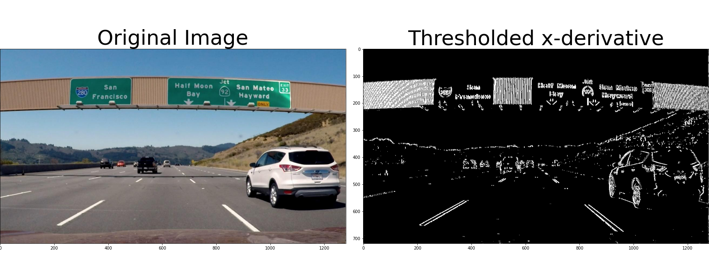
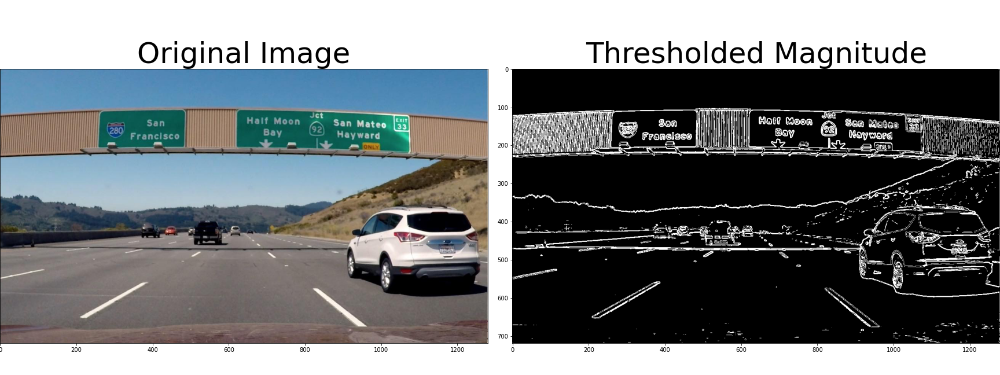
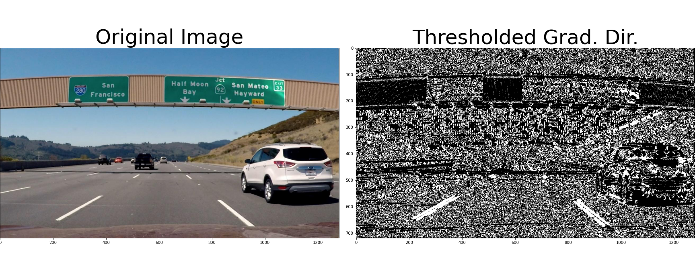
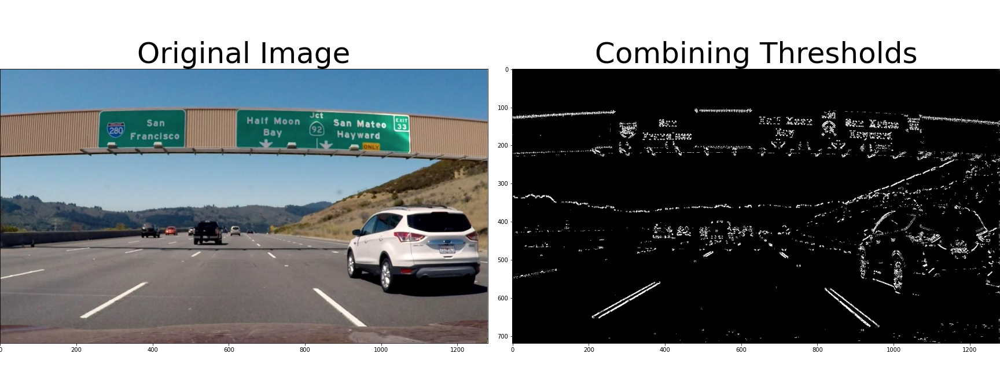

# Gradient Threshold :  Canny edge detection algorithm

In this project, I used various aspects of your gradient measurements (x, y, magnitude, direction) to isolate lane-line pixels

**Sobel Operator**

**Magnitude of the Gradient**

** Direction of the Gradient**

**Combining Thresholds**

